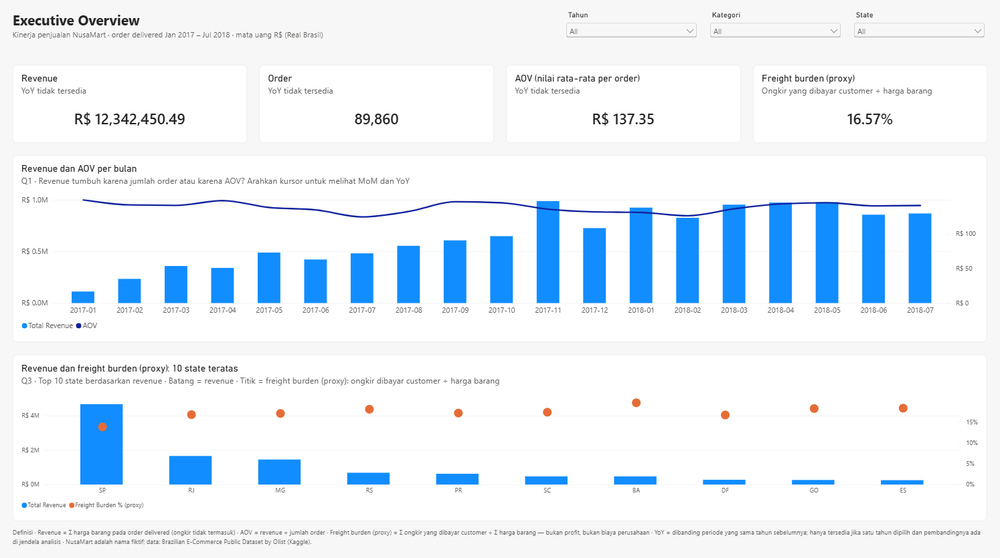
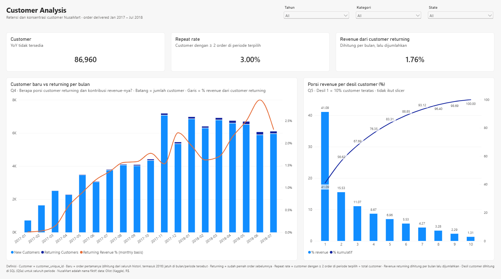
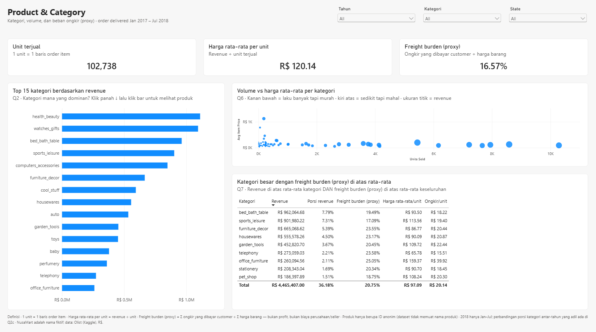

# NusaMart — E-Commerce Sales & Customer Analytics

> End-to-end business analysis project: dari data transaksi mentah menjadi dashboard, insight, dan rekomendasi bisnis untuk manajemen.

**Dashboard publik (Power BI):** [buka dashboard interaktif](https://app.powerbi.com/view?r=eyJrIjoiNWQ3ZjljMjgtZmRjZS00YjhjLWI2ZjctZGViNmIxNTJiMTJiIiwidCI6IjM0ODViOTYzLTgyYmEtNGE2Zi04MTBmLWI1Y2MyMjZmZjg5OCIsImMiOjEwfQ%3D%3D)

## Dashboard

Tiga halaman dengan filter yang sama (Tahun, Kategori, State) dan jendela analisis 2017-01 s/d 2018-07.

**Executive Overview:** KPI utama dengan perbandingan periode yang sama tahun lalu, tren revenue & AOV per bulan, dan 10 state teratas beserta freight burden (proxy).



**Customer Analysis:** customer baru vs returning per bulan, repeat rate, dan konsentrasi revenue per desil customer.



**Product & Category:** 15 kategori teratas (drill-down ke produk), volume vs harga rata-rata per kategori, dan kategori besar dengan freight burden (proxy) di atas rata-rata.



## Business problem

NusaMart (perusahaan fiktif) memiliki data transaksi dalam jumlah besar, tetapi manajemen belum dapat menjawab pertanyaan dasar secara konsisten: dari mana pertumbuhan berasal, kategori mana yang dominan, seberapa loyal customer, dan di mana beban ongkir yang ditanggung customer paling tinggi.

Project ini membangun satu sumber angka yang konsisten dan menerjemahkannya menjadi rekomendasi. Detail lengkap: [Business Requirements Document](docs/business_requirements.md).

## Pendekatan

```
Raw CSV (Olist) → Python/Pandas → PostgreSQL (star schema) → SQL analysis → Power BI → Insight & rekomendasi
```

| Tahap | Tool | Output |
|---|---|---|
| Data understanding & cleaning | Python, Pandas | [`notebooks/01_data_cleaning.ipynb`](notebooks/01_data_cleaning.ipynb) |
| Data model | PostgreSQL | [`sql/01_create_schema.sql`](sql/01_create_schema.sql) |
| Analisis | SQL | [`sql/`](sql/) — satu query per business question |
| Dashboard | Power BI | [`powerbi/`](powerbi/) — Power BI Project (.pbip), 3 halaman: Executive, Customer, Product & Category |
| Rekomendasi | — | [`docs/insights_and_recommendations.md`](docs/insights_and_recommendations.md) |

**Validasi angka:** KPI utama identik di notebook, SQL ([`sql/05_kpi_reference.sql`](sql/05_kpi_reference.sql)), dan dashboard — misalnya revenue R$ 12.342.450,49 dari 89.860 order dan 86.960 customer.

## Key insights

Jendela analisis 2017-01 s/d 2018-07. Bukti lengkap, hipotesis, dan rekomendasi: [`docs/insights_and_recommendations.md`](docs/insights_and_recommendations.md).

- **Pertumbuhan hampir seluruhnya dari volume:** revenue Jan–Jul 2018 naik 161,6% dibanding Jan–Jul 2017, tetapi AOV hanya +0,3%.
- **Retensi sangat rendah, dan bukan karena customer belum sempat kembali:** 97,0% customer hanya belanja sekali, dan dari kohort Jan–Jun 2017 yang diamati penuh 12 bulan, hanya 3,32% yang order lagi di hari lain.
- **Revenue terkonsentrasi pada pembelian besar sekali jalan:** 10% customer teratas menyumbang 41,09% revenue, tetapi 91,99% revenue kelompok ini berasal dari customer yang hanya belanja sekali.
- **Ongkir yang dibayar customer membebani secara tidak merata:** sembilan kategori besar (36,18% revenue) punya freight burden di atas rata-rata 16,57%, dan di beberapa state utara/timur laut bebannya mencapai sekitar 24–28%, jauh di atas SP (13,80%).
- **Mix kategori bergeser** (periode sebanding Jan–Jul): `watches_gifts` naik dari peringkat #6 ke #2, sementara porsi `cool_stuff` turun dari 6,89% ke 3,32%.

## Keputusan data yang penting

- Revenue hanya dari order `delivered`, tanpa ongkir.
- Customer diidentifikasi dengan `customer_unique_id` (bukan `customer_id`, yang berbeda di setiap order).
- Dataset tidak memiliki cost, sehingga **profit tidak dianalisis**. Sebagai gantinya dipakai proxy *freight burden* = Σ ongkir ÷ Σ harga barang. Ongkir (`freight_value`) di dataset ini **dibayar oleh customer**, jadi freight burden mengukur **beban ongkir yang ditanggung customer** relatif terhadap harga barang — bukan profit, dan bukan biaya perusahaan.
- Analisis memakai **jendela 2017-01 s/d 2018-07**. Bulan di kedua ujung dataset yang datanya tidak lengkap ditandai lewat kolom `dim_date.is_analysis_month` dan dikecualikan secara konsisten di SQL maupun dashboard. Kelengkapan bulan dicek dari total bulanan, porsi order delivered, dan — untuk bulan terakhir — jumlah order **per hari**. Cek harian inilah yang menemukan bahwa pengumpulan data Agustus 2018 berakhir di tengah bulan. Perbandingan antartahun memakai periode sebanding Jan–Jul.

## Cara menjalankan ulang

1. Download dataset dari Kaggle ([Brazilian E-Commerce Public Dataset by Olist](https://www.kaggle.com/datasets/olistbr/brazilian-ecommerce)), taruh 5 CSV di `data/raw/`.
2. `pip install -r requirements.txt`
3. Jalankan `notebooks/01_data_cleaning.ipynb`.
4. Buat database `nusamart` di PostgreSQL, jalankan `sql/01_create_schema.sql`.
5. Set `NUSAMART_DB_URL`, lalu `python src/load_to_postgres.py`.
6. Jalankan query di `sql/02`–`05`.
7. Buka `powerbi/NusaMart.pbip` di Power BI Desktop (PostgreSQL harus berjalan di `localhost:5433`), lalu **Refresh**. Definisi measure ada di [`powerbi/dax_measures.md`](powerbi/dax_measures.md) dan panduan dashboard di [`powerbi/dashboard_build_guide.md`](powerbi/dashboard_build_guide.md). Versi yang dipublikasikan adalah `powerbi/NusaMart - PORTFOLIO.pbip`.

## Struktur repository

```
├── data/            # raw & processed (tidak di-upload)
├── notebooks/       # data understanding & cleaning
├── src/             # script load ke PostgreSQL + cek right-censoring
├── sql/             # schema + analisis (satu query per business question)
├── results/         # ringkasan hasil query (CSV) yang dirujuk insight
├── powerbi/         # Power BI Project (.pbip): model TMDL, report PBIR, DAX measures, panduan
├── screenshots/     # tangkapan layar dashboard
└── docs/            # BRD, data dictionary, insights
```

## Data & atribusi

Data: [*Brazilian E-Commerce Public Dataset by Olist*](https://www.kaggle.com/datasets/olistbr/brazilian-ecommerce) (Olist, Kaggle), lisensi [CC BY-NC-SA 4.0](https://creativecommons.org/licenses/by-nc-sa/4.0/). Turunan data di repo ini (ringkasan di `results/` dan dashboard) dibagikan dengan lisensi yang sama untuk keperluan non-komersial. NusaMart adalah nama fiktif untuk keperluan studi kasus; wilayah asli (state Brasil) dipertahankan.

## Catatan pengerjaan

Project ini dikerjakan dengan bantuan AI coding assistant, dengan semua keputusan analisis dan validasi angka saya review sendiri.
